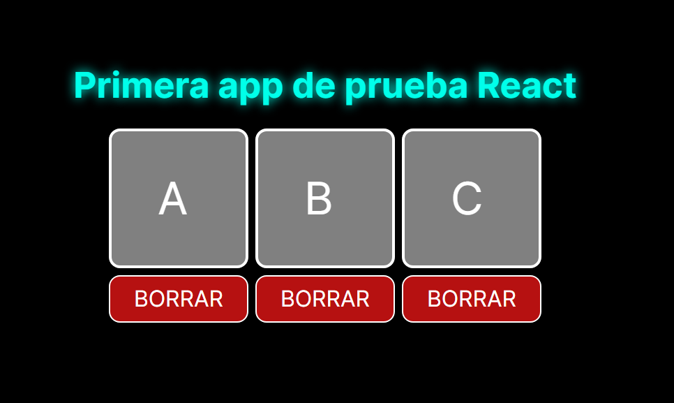

# Proyecto de prueba para probar react 😎

## Guia de instalacion 🤓
1. Clonar el repositorio
2. Moverse a la carpeta del proyecto
3. Instalar las dependencias con el comando `npm install`
4. Ejecturar el proyecto con el comando `npm run dev`
5. Disfruta 😉

## Funcionalidades 🤯
- Modificar valor de la celda,
- Añadir celdas intermedias al hacer click en los espacios vacios.
- Borrar celdas **(no se puede borrar si solamente hay 2 celdas)**.
- Mostrar resultado en pantalla al pulsar la tecla *Enter*.
  

